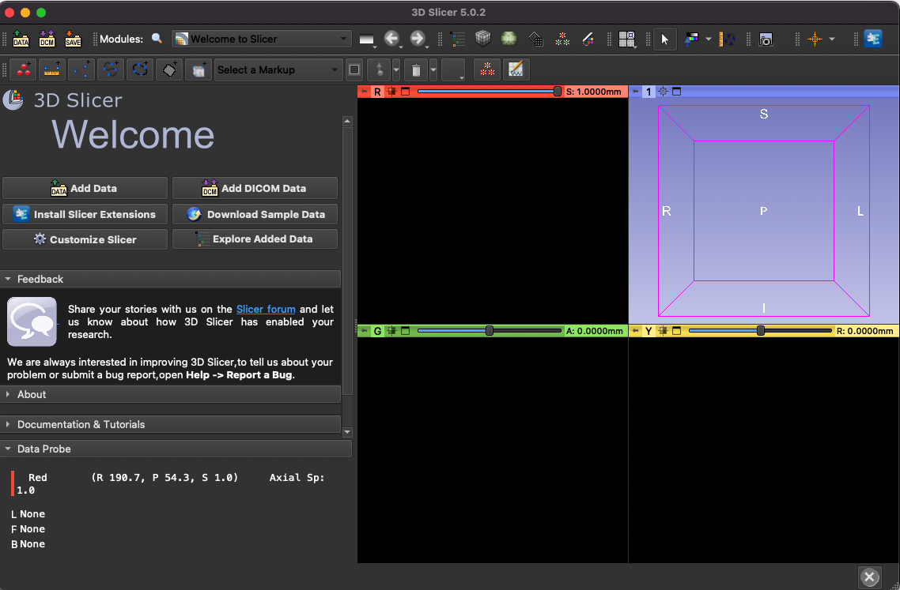

# 3D Slicer Tips

A collection of tips when using [3D Slicer tool](https://www.slicer.org/), because sometimes things are not trivial and well documented. 

*3D Slicer welcome panel*

## Basic

* [Show image slices on the 3D view](basic/show-images-slices-on-3d.md)

## Navigations

- [Multiplanar reformatting (MPR)](basic/interactive-multiplanar-reformatting.md)
- [Reformatting image planes via 3D view](basic/reformat-via-3d.md)
- Curvilinear multiplanar reformatting
