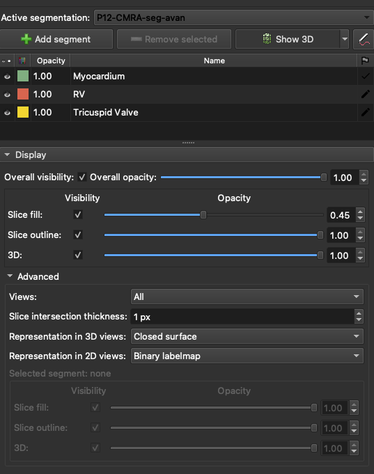

# Opacity for 3D objects

It's not that clear at the beginning how to do that, but I've found several ways to adjust transparency for 3D objects.

## Use any 2D view toolbar options

In any 2D views, you can click the leftmost icon to reveal more options.

1. Click this icon to reveal more options for the view

2. Click this icon toshow display options

3. The eye icon to show the segmentation objects in all panels

4. The arrow button will show opacity slider

5. Move the opacity slider (or enter the opacity number) to adjust the object opacity in all views. 

## Use segmentations panel

With the Segmentations panel, you can modify display option in more detailed.

