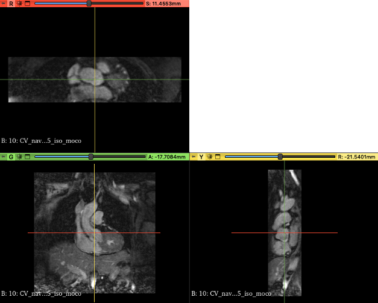
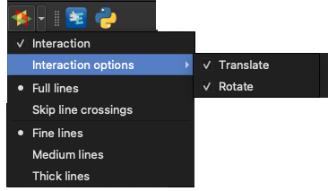
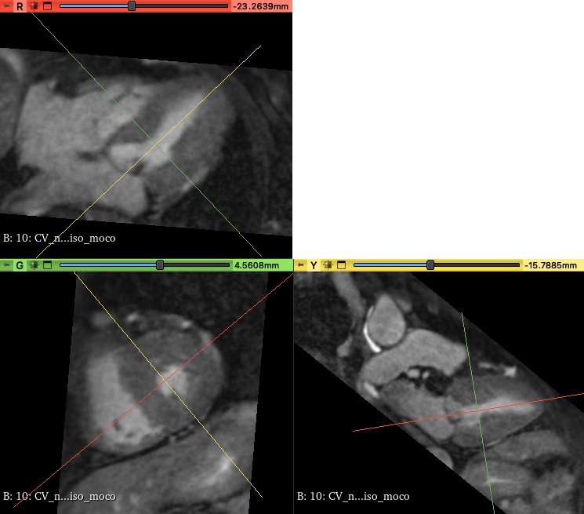

# Interactive Multiplanar Reformatting

Find this icon on the toolbar: 

Clicking this icon will show crossbars on each views. Each crossbar line has a color corresponding to the view's color.

To activate the interactive crossbars, click the checkmark. You can also limit the interactions either or both for translation and rotation.

Here's an example of positioning the three views for 3D cardiac MR angiography into the usual short-axis, two-chamber & four-chamber views.

