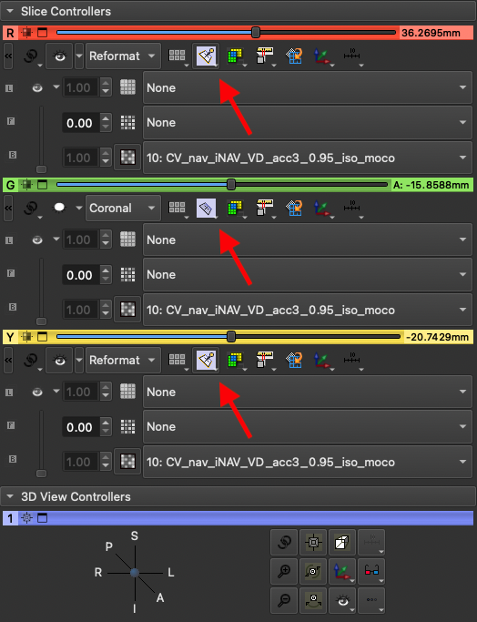
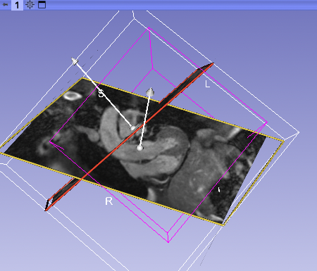

# Reformatting image planes via 3D view

You can reformat 2D image plane by using 3D interactive widgets. It's a bit difficult than the [multiplanar reformatting by using interactive crossbars](interactive-multiplanar-reformatting.md).

To activate the 3D reformatting widget, click pin icon on the view toolbar or from the View Controller panel below:

*View Controller panel*

The widget shown in 3D view

