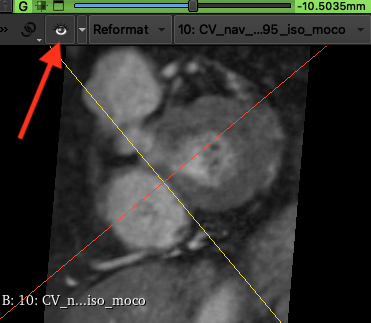
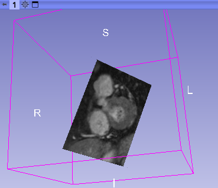

# Show image slice on 3D view

Activate the eye icon (red arrow on the image below) on the 2D view pop up toolbar (press the << icon on the left).

This will show the image slice on the 3D view

You can scroll the slider on the 2D view toolbar and see how the slice changes in the 3D view.
